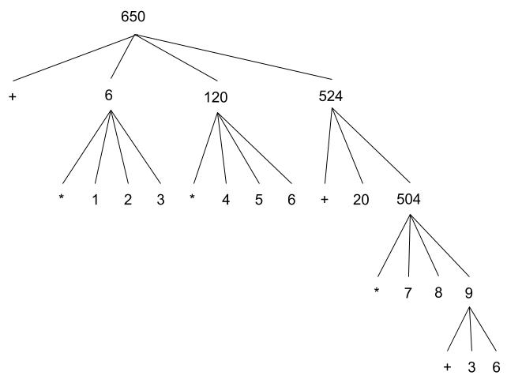

As part of my learning journey with Clojure, I've decided to take a bit of a detour and go through
the classic "Structure and Interpretation of Computer Programs" first. I just finished reading
sections 1.1.1 - 1.1.3 and want to share what I've learned so far.

### Simple expressions are the building blocks of Lisp

Simple (primitive) expressions are the basic units of Lisp (or any programming language for that
matter). They could either be primitive procedures (i.e. mathematical operators) or primitive
values (i.e. numbers, strings, booleans). Let's type some simple expressions into the Scheme REPL
to get familar with them.

#### Simple Expressions

```scheme
100
===> 100

"hello"
===> "hello"

false
===> false
```

So yeah nothing fancy here. One would expect these results from the REPL of any programming language.

### Compound expressions are formed by combining simple expressions together

A compound expression (combination) is formed by combining a primitive procedure (operator)
with primitive values (operands). Let's type some compound expressions into the Scheme REPL to get
familar with them.

#### Compound Expressions

```scheme
(+ 1 2 3)
===> 6

(+ (* 1 2 3) (* 4 5 6) (+ 20 (* 7 8 (+ 3 6))))
===> 650
```

Now we're getting into some Lisp syntax! Compound expressions in Lisp are formed by combining a
primitive procedure (an *operator*) with a number of primitive values (*operands*) enclosed in parentheses.
The value of the expression is obtained by applying the operator to the values of the operands.

So in the first example, the plus operator (`+`) is being applied to the values of the operands
(`1 2 3`). When the expression is evaluated, the final value of the expression is the sum (`6`) of
the values of the operands.

As you may have noticed, `+ 1 2 3` is not typically how we notate addition. Lisp follows the
convention of "operator first, operands last", also known as *prefix notation*. By contrast, the
way we normally notate addition `1 + 2 + 3` is known as *infix notation*.

This may be weird at first, but there are good reasons for why Lisp adopted prefix notation. First,
prefix notation allows an operator to take an arbitrary number of arguments (i.e. the plus operator
`+` can take any number of numbers). Second, prefix notation with parentheses naturally allows
*nesting* of expressions, wherein a compound expression could contain expressions that are also
compound expressions.

The second example is a nested compound expression. Evaluation of the nested compound expression
involves evaluating each of the expressions (`(* 1 2 3)`, `(* 4 5 6)`, and `(+ 20 (* 7 8 (+ 3 6)))`)
within the overarching expression.

### Evaluating nested compound expressions in practice

A compound expression like `(+ 1 2 3)` is pretty easy to read. However, a nested compound expression
like `(+ (* 1 2 3) (* 4 5 6) (+ 20 (* 7 8 (+ 3 6))))` is not. Evaluating this expression requires a
lot of mental overhead (deciding which expression to evaluate first, keeping track of evaluated
expressions, a recursive evaluation mental model that evaluates right-to-left rather than
left-to-right, etc). Fortunately, we can pretty-print the nested compound expression to make it
easier to read.

#### Pretty-printed Compound Expression

```scheme
(+ (* 1 2 3)
   (* 4 5 6)
   (+ 20
      (* 7 8
         (+ 3 6))))
```

Now, evaluating the pretty-printed nested compound expression is simply a matter of reading
right-to-left, evaluating expressions by indentation level as you go. Let's do that!

```scheme
(+ (* 1 2 3)
   (* 4 5 6)
   (+ 20
      (* 7 8 9))))
```

```scheme
(+ (* 1 2 3)
   (* 4 5 6)
   (+ 20 504))))
```

```scheme
(+ 6 120 524)
```

```scheme
===> 650
```

Pretty neat!

### Visualizing Lisp Evaluation as a Tree of Expressions

Ok now for the big reveal. Lisp evaluation is a tree of expressions! See the image below for a tree
representation of evaluation of the nested compound expression in prior section.



One can see that as one progresses up the levels of the tree, each successive evaluation reduces
one or more compound expressions, causing the calculated values to rise upwards. Eventually, we
reach the root node of the tree, which is the final result of the entire nested compound expression.
In general, this process is known as *tree accumulation*.

And it gets even better! Looking at the pretty-printed nested compound expression, we can see that
the indentation level corresponds with the depth of the tree! No indentation corresponds to a depth
of 1 (the first row after the root node), while each successive indentation level corresponds to
successive rows in the tree.
